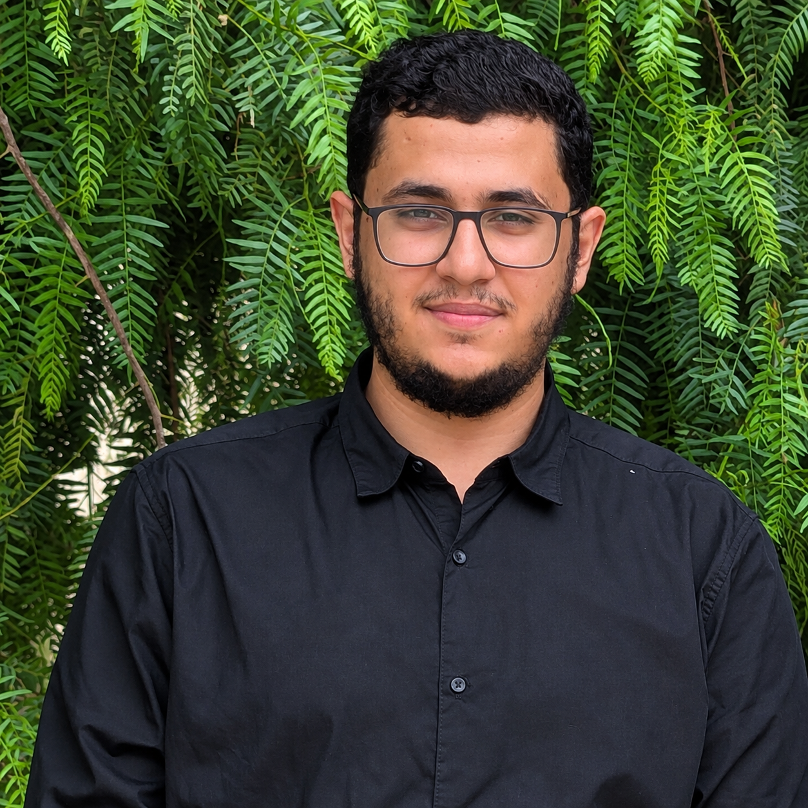

<!-- ===================== HEADER ===================== -->

<div align="center">

  

  <br>

  

  <br><br>

  <a href="https://www.linkedin.com/in/tarek-zerari-197736331/">
    
  </a>
  <a href="mailto:nt_zerari@esi.dz">
    
  </a>
  <a href="https://github.com/tarekzerari-dev">
    
  </a>

</div>

---

<!-- ===================== ABOUT ===================== -->

## 👋 About Me



I'm **Tarek Zerari**, a **3rd-year Computer Science Engineering student at École Nationale Supérieure d'Informatique (ESI), Algiers** 🇩🇿.

I'm passionate about **Artificial Intelligence, Machine Learning, Software Engineering, and building practical digital solutions**.

I enjoy turning ideas into real products — from educational platforms and management systems to AI-oriented projects and community initiatives.

### 🎓 Currently

- 🎓 Computer Science Engineering — **ESI Algiers**
- 🤖 Exploring **Artificial Intelligence & Machine Learning**
- 💻 Building full-stack web applications
- 🧠 Interested in algorithms, optimization and intelligent systems
- 🔐 Active in the cybersecurity community through **Shellmates**
- 🤝 **External Relations Manager — Shellmates Club, ESI**
- 🚀 Turning real-world problems into software solutions

---

## 🧰 Tech Stack

### 💻 Programming & Web

<p align="left">


</p>

### 🗄️ Data & Backend

<p align="left">


</p>

### 🤖 AI & Data Science

<p align="left">


<br>


</p>

---

# 🚀 Featured Projects

## 📚 eCours

**Educational Management Platform**

A digital platform designed to help educational centers and teachers manage their daily operations through a centralized system.

**Highlights**

- 👨‍🎓 Student & group management
- 📋 Attendance tracking
- 💳 Subscription & payment management
- 📱 QR-based attendance
- 🔔 Parent notifications
- 📚 Educational document management

**Tech:** `Next.js` `TypeScript` `Supabase` `PostgreSQL`

---

## 📖 Sanad Quran

**Quran Education & Management Platform**

A digital platform designed for Quran schools to manage students, memorization progress, attendance and educational activities.

**Highlights**

- 👨‍🎓 Student management
- 📊 Memorization progress
- 🗓️ Weekly schedules
- ✅ Attendance tracking
- 🏆 Competition management
- 👨‍👩‍👧 Parent follow-up
- 📚 Educational diary

**Tech:** `Next.js` `TypeScript` `Supabase`

---

## 🧪 LMCS Supervision Management

**Academic Supervision Management Platform**

A centralized platform developed for the **LMCS Laboratory** to streamline academic supervision and coordination between students, supervisors, research teams and administration.

**Highlights**

- 👨‍🎓 Student management
- 👨‍🏫 Supervisor management
- 🔬 Research team organization
- 📋 Academic supervision workflows
- 🏢 Administrative processes

**Tech:** `Web Development` `Database` `REST APIs`

---

# 🤝 Leadership & Community

## 🔐 Shellmates Club — ESI

### External Relations Manager

I'm currently serving as **External Relations Manager at Shellmates Club**, an ESI-based cybersecurity community.

My role involves:

- 🤝 Building external partnerships
- 📩 Managing professional outreach
- 🌍 Representing the club externally
- 🏢 Communicating with companies and organizations
- 🎯 Supporting events and partnership initiatives

### 🏴 Besides — Cybersecurity Hackathon

**Cybersecurity Hackathon Organizer**

Contributed to organizing a cybersecurity-focused event bringing students and technology enthusiasts together around practical security challenges.

---

# 🧠 Research Interests

I'm particularly interested in exploring:

- 🤖 Artificial Intelligence
- 🧬 Machine Learning
- 🧠 Deep Learning
- 🔎 Representation Learning
- 🎓 AI for Education
- ⚡ Algorithms & Optimization
- 📊 Data-driven systems

---

# 🏆 Learning & Certifications

I'm continuously developing my knowledge through:

- 🤖 Artificial Intelligence & Machine Learning training
- 🧠 Deep Learning & Representation Learning
- 💻 Software Engineering projects
- 🔐 Cybersecurity community activities
- 🎓 Academic and technical certifications

> Always learning. Always building. Always improving.

---

# 📊 GitHub Statistics

<div align="center">


</div>

<br>

<div align="center">


</div>

---

# 🌱 What I'm Working On

```text
Building real-world software
        ↓
Exploring Artificial Intelligence
        ↓
Learning Machine Learning & Deep Learning
        ↓
Contributing to the tech community
        ↓
Preparing for research & international opportunities
